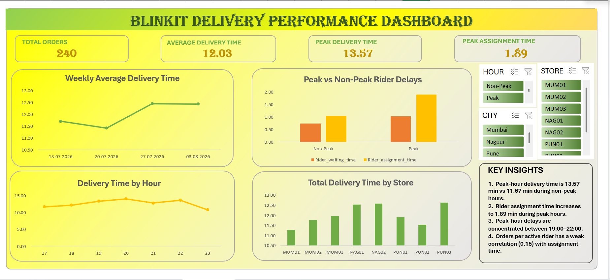

# blinkit-delivery-analysis
Blinkit delivery performance and operational delay analysis using Excel.

# Blinkit Delivery Performance & Operational Delay Analysis

## 📌 Project Overview

This project analyzes Blinkit's delivery performance to identify the key operational factors contributing to delivery delays.

The analysis focuses on different stages of the delivery process, including picking, packing, rider assignment, rider waiting, and final delivery time.

The project was developed using Microsoft Excel to perform data analysis, create PivotTables, identify trends, and build an interactive dashboard.

---

## 🎯 Business Problem

Blinkit aims to provide fast delivery to customers. However, delivery time can increase during certain periods and locations.

The main business questions addressed in this project are:

- Why does delivery time increase during peak hours?
- Which operational stage contributes most to delivery delays?
- Which stores experience higher delivery delays?
- Does rider availability affect delivery performance?
- When should additional riders be positioned?
- What operational improvements can reduce delivery delays?

---

## 🛠️ Tools Used

- Microsoft Excel
- PivotTables
- Excel Charts
- Slicers
- Data Cleaning
- Exploratory Data Analysis
- Dashboard Development

---

## 📊 Key Metrics

The analysis focuses on:

- Total Orders
- Average Delivery Time
- Peak Delivery Time
- Rider Assignment Time
- Rider Waiting Time
- Picking Time
- Packing Time
- Delivery Time
- Peak Orders per Active Rider

---

## 🔎 Key Findings

### 1. Peak-hour delivery delays

Average delivery time during peak hours was **13.57 minutes**, compared with **11.67 minutes** during non-peak hours.

This indicates that peak-hour delivery performance is significantly slower.

### 2. Rider assignment is a major contributor

Average rider assignment time increased from **1.04 minutes during non-peak hours** to **1.89 minutes during peak hours**.

This suggests that rider assignment and dispatch efficiency are important areas for investigation.

### 3. Rider waiting also increases

Average rider waiting time increased from **0.74 minutes** during non-peak hours to **1.03 minutes** during peak hours.

This indicates potential issues around store readiness and rider-store handoff.

### 4. Evening hours show higher delays

The analysis identified **19:00–22:00** as an important period where delivery times and rider-related delays increase.

### 5. Rider capacity alone does not explain delays

The correlation between peak orders per active rider and rider assignment time was approximately **0.15**.

This is a weak positive relationship, suggesting that rider workload alone does not fully explain assignment delays.

---

## 💡 Recommendations

Based on the analysis, the following actions are recommended:

1. **Optimize rider allocation during 19:00–22:00**
   
   Position additional riders at stores experiencing high peak demand and operational delays.

2. **Improve rider assignment and dispatch**
   
   Investigate the rider assignment process to reduce the time required to assign riders to orders.

3. **Investigate store handoff processes**
   
   Analyze whether delays in picking, packing, or order readiness are causing riders to wait.

4. **Monitor store-level performance**
   
   Identify stores with consistently high delivery times and rider waiting times and investigate their operational processes.

---

## 📈 Dashboard

The Excel dashboard provides an interactive view of delivery performance using:

- KPI cards
- Weekly delivery trends
- Peak vs non-peak analysis
- Evening-hour analysis
- Store performance
- City and store slicers
- Hour-based filtering

---
### Dashboard Preview

---

## 📂 Project Files

The repository contains:

- Excel analysis file
- Dashboard screenshots
- Project documentation

---

## 👩‍💻 Author

**Vaishnavi Dahilkar**

Data Analyst | Excel | Data Analysis
